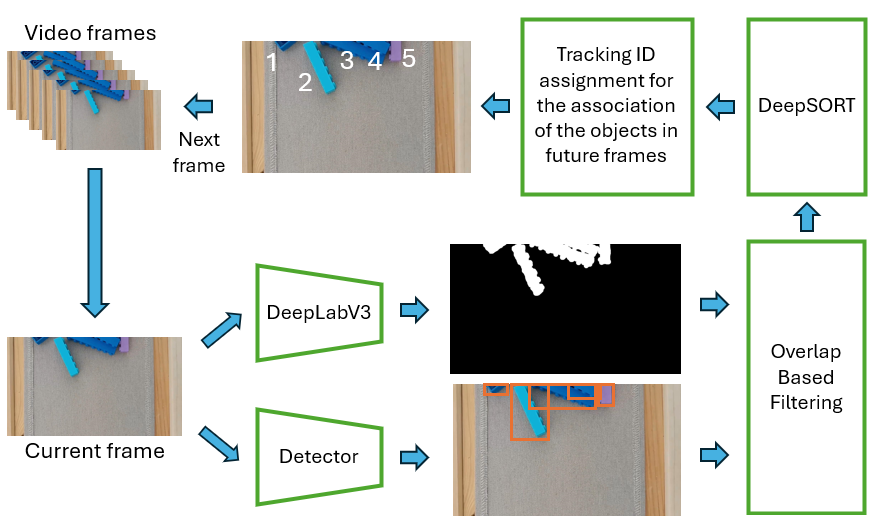

   <h1>2D Lego Tracking - Object Counter</h1>
   <h2>AI Laboratory Work (ELTE 2025 - Summer Work + Autumn Semester)</h2>
   

It is a research based project in which object detection, segmentation, and tracking algorithms focusing on LEGO bricks in real-world video recordings are used. Using YOLOv8 and RT-DETR models for the detection, DeepLabv3 for semantic segmentation and DeepSORT for tracking, the research evaluates performance in building an object counter. <b> For the detailed information, you can read the report. </b>

## Technology
- **Python**: Main programming language. 
- **PyTorch**: Machine Learning framework. 
- **Ultralytics**: AI platform that makes the usage of YOLOv8 and RT-DETR models easy. 
- **OpenCV**: Used for controlling video frames and processing them. 
- **RoboFlow**: It is a platform used to annotate images with boundary boxes. 
- **Kaggle**: This platform has been used to store data. 

## Google Colab 
- To train or fine-tune detection and segmentation models, usage of GPU is recommended.
- During research, codes have been executed in Google Colab as it is a hosted Jupyter Notebook service that provides free access to computing resources, including GPUs and TPUs.

## Dataset
- In this research, the dataset was manually created using a smartphone, consisting of 12 videos — 10 for training and 2 for testing. These videos capture conveyor belts with LEGO bricks from multiple angles with varying complexities for diversity. LEGO bricks were annotated frame-by-frame using RoboFlow (https://roboflow.com/), which was the most time-consuming step.
- Dataset is publicly available in Kaggle: https://www.kaggle.com/datasets/hbahruz/multiple-lego-tracking-dataset

## Pipeline

   

## Using this project

### Acknowledgments
This project leverages the following tools and frameworks:

